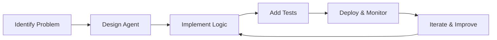

# 🎯 Agent Development Guide

Learn how to build, customize, and deploy your own intelligent business automation agents.

## Agent Development Lifecycle



## Step 1: Problem Identification

### Business Problem Analysis
Before building an agent, clearly define:

1. **What manual process** needs automation?
2. **Who are the users** and what are their pain points?
3. **What data sources** are available?
4. **What is the expected outcome** and success metrics?
5. **What are the constraints** (time, budget, compliance)?

### Example: Customer Churn Prediction Agent
```
Problem: Sales team manually reviews customer data to identify churn risk
Users: Sales managers, account managers
Data: CRM data, support tickets, usage metrics
Outcome: Automated churn risk scoring with actionable insights
Constraints: Must integrate with existing Salesforce setup
```

## Step 2: Agent Design

### Architecture Patterns

#### 1. Data Processing Agent
```typescript
// Pattern: Input → Process → Output
export async function POST(req: NextRequest) {
  // 1. Validate input
  const input = InputSchema.parse(await req.json());
  
  // 2. Process data
  const result = await processData(input);
  
  // 3. Return structured output
  return NextResponse.json(OutputSchema.parse(result));
}
```

#### 2. AI-Powered Agent
```typescript
// Pattern: Input → AI Analysis → Structured Output
export async function POST(req: NextRequest) {
  const input = await req.json();
  
  // Generate AI prompt
  const prompt = buildPrompt(input);
  
  // Call LLM
  const aiResponse = await callLLM(prompt);
  
  // Parse and validate AI output
  const structured = parseAIResponse(aiResponse);
  
  return NextResponse.json(structured);
}
```

#### 3. Workflow Orchestration Agent
```typescript
// Pattern: Input → Multiple Steps → Aggregated Output
export async function POST(req: NextRequest) {
  const input = await req.json();
  
  // Execute workflow steps
  const step1 = await executeStep1(input);
  const step2 = await executeStep2(step1);
  const step3 = await executeStep3(step2);
  
  // Aggregate results
  const result = aggregateResults([step1, step2, step3]);
  
  return NextResponse.json(result);
}
```

### Schema Design
Always define clear input/output schemas:

```typescript
// lib/schemas/customer-churn.ts
import { z } from 'zod';

export const CustomerData = z.object({
  customer_id: z.string(),
  account_value: z.number(),
  last_login: z.string().datetime(),
  support_tickets: z.number(),
  feature_usage: z.record(z.number()),
  contract_end_date: z.string().datetime()
});

export const ChurnPrediction = z.object({
  customer_id: z.string(),
  churn_probability: z.number().min(0).max(1),
  risk_level: z.enum(['low', 'medium', 'high', 'critical']),
  risk_factors: z.array(z.string()),
  recommended_actions: z.array(z.string()),
  confidence_score: z.number().min(0).max(1)
});
```

## Step 3: Implementation

### Creating a New Agent

#### 1. Set Up the API Route
```bash
# Create the API route file
mkdir -p app/api/customer-churn
touch app/api/customer-churn/route.ts
```

#### 2. Implement the Core Logic
```typescript
// app/api/customer-churn/route.ts
import { NextRequest, NextResponse } from "next/server";
import { CustomerData, ChurnPrediction } from "@/lib/schemas/customer-churn";
import { predictChurn } from "@/lib/agents/customer-churn";

export async function POST(req: NextRequest) {
  try {
    // Parse and validate input
    const body = await req.json();
    const customerData = CustomerData.parse(body);
    
    // Execute agent logic
    const prediction = await predictChurn(customerData);
    
    // Validate and return output
    const result = ChurnPrediction.parse(prediction);
    return NextResponse.json(result);
    
  } catch (error) {
    console.error("Customer Churn Agent Error:", error);
    
    if (error instanceof z.ZodError) {
      return NextResponse.json(
        { error: "Invalid input data", details: error.errors },
        { status: 400 }
      );
    }
    
    return NextResponse.json(
      { error: "Internal server error" },
      { status: 500 }
    );
  }
}
```

#### 3. Implement Business Logic
```typescript
// lib/agents/customer-churn.ts
import { CustomerData, ChurnPrediction } from "@/lib/schemas/customer-churn";
import { callLLM } from "@/lib/openrouter";

export async function predictChurn(customer: CustomerData): Promise<ChurnPrediction> {
  // Calculate risk factors
  const riskFactors = await analyzeRiskFactors(customer);
  
  // Use AI for complex pattern recognition
  const aiAnalysis = await getAIAnalysis(customer, riskFactors);
  
  // Combine rule-based and AI analysis
  const prediction = combineAnalysis(riskFactors, aiAnalysis);
  
  return prediction;
}

async function analyzeRiskFactors(customer: CustomerData) {
  const factors = [];
  
  // Rule-based analysis
  const daysSinceLogin = getDaysSince(customer.last_login);
  if (daysSinceLogin > 30) {
    factors.push("Inactive for 30+ days");
  }
  
  if (customer.support_tickets > 5) {
    factors.push("High support ticket volume");
  }
  
  const contractDaysRemaining = getDaysUntil(customer.contract_end_date);
  if (contractDaysRemaining < 60) {
    factors.push("Contract expiring soon");
  }
  
  // Feature usage analysis
  const avgUsage = Object.values(customer.feature_usage).reduce((a, b) => a + b, 0) / 
                   Object.keys(customer.feature_usage).length;
  if (avgUsage < 0.2) {
    factors.push("Low feature adoption");
  }
  
  return factors;
}

async function getAIAnalysis(customer: CustomerData, riskFactors: string[]) {
  const prompt = `
    Analyze this customer data for churn risk:
    
    Customer ID: ${customer.customer_id}
    Account Value: $${customer.account_value}
    Days Since Last Login: ${getDaysSince(customer.last_login)}
    Support Tickets: ${customer.support_tickets}
    Feature Usage: ${JSON.stringify(customer.feature_usage)}
    Contract Days Remaining: ${getDaysUntil(customer.contract_end_date)}
    
    Identified Risk Factors: ${riskFactors.join(', ')}
    
    Provide:
    1. Churn probability (0.0 to 1.0)
    2. Risk level (low/medium/high/critical)
    3. Top 3 recommended actions
    4. Confidence score (0.0 to 1.0)
    
    Return as JSON.
  `;
  
  const response = await callLLM(prompt);
  return JSON.parse(response);
}
```

### Adding Data Sources

#### Database Integration
```typescript
// lib/data-sources/crm.ts
import { createClient } from '@supabase/supabase-js';

const supabase = createClient(
  process.env.NEXT_PUBLIC_SUPABASE_URL!,
  process.env.SUPABASE_SERVICE_ROLE_KEY!
);

export async function getCustomerData(customerId: string) {
  const { data, error } = await supabase
    .from('customers')
    .select(`
      *,
      support_tickets(count),
      feature_usage(*)
    `)
    .eq('id', customerId)
    .single();
    
  if (error) throw error;
  return data;
}
```

#### External API Integration
```typescript
// lib/data-sources/salesforce.ts
import { Connection } from 'jsforce';

const conn = new Connection({
  loginUrl: 'https://login.salesforce.com'
});

export async function getSalesforceData(accountId: string) {
  await conn.login(
    process.env.SALESFORCE_USERNAME!,
    process.env.SALESFORCE_PASSWORD! + process.env.SALESFORCE_SECURITY_TOKEN!
  );
  
  const result = await conn.sobject('Account').findOne({
    Id: accountId
  });
  
  return result;
}
```

### Error Handling & Logging

#### Structured Error Handling
```typescript
// lib/errors.ts
export class AgentError extends Error {
  constructor(
    message: string,
    public code: string,
    public statusCode: number = 500,
    public details?: any
  ) {
    super(message);
    this.name = 'AgentError';
  }
}

export class ValidationError extends AgentError {
  constructor(message: string, details?: any) {
    super(message, 'VALIDATION_ERROR', 400, details);
  }
}

export class ExternalAPIError extends AgentError {
  constructor(service: string, message: string) {
    super(`${service} API error: ${message}`, 'EXTERNAL_API_ERROR', 502);
  }
}
```

#### Comprehensive Logging
```typescript
// lib/logger.ts
import winston from 'winston';

const logger = winston.createLogger({
  level: process.env.LOG_LEVEL || 'info',
  format: winston.format.combine(
    winston.format.timestamp(),
    winston.format.errors({ stack: true }),
    winston.format.json()
  ),
  transports: [
    new winston.transports.Console(),
    new winston.transports.File({ filename: 'logs/agents.log' })
  ]
});

export function logAgentExecution(
  agentName: string,
  input: any,
  output: any,
  duration: number,
  error?: Error
) {
  const logData = {
    agent: agentName,
    duration,
    timestamp: new Date().toISOString(),
    input_size: JSON.stringify(input).length,
    output_size: JSON.stringify(output).length,
    success: !error
  };
  
  if (error) {
    logger.error('Agent execution failed', { ...logData, error: error.message });
  } else {
    logger.info('Agent execution completed', logData);
  }
}
```

## Step 4: Testing Your Agent

### Unit Tests
```typescript
// tests/agents/customer-churn.test.ts
import { describe, it, expect, vi } from 'vitest';
import { predictChurn } from '@/lib/agents/customer-churn';

describe('Customer Churn Agent', () => {
  it('should identify high-risk customer', async () => {
    const highRiskCustomer = {
      customer_id: 'cust-123',
      account_value: 50000,
      last_login: '2025-08-01T00:00:00Z', // 2+ months ago
      support_tickets: 8, // High volume
      feature_usage: { feature1: 0.1, feature2: 0.05 }, // Low usage
      contract_end_date: '2025-11-01T00:00:00Z' // Expiring soon
    };
    
    const prediction = await predictChurn(highRiskCustomer);
    
    expect(prediction.risk_level).toBe('high');
    expect(prediction.churn_probability).toBeGreaterThan(0.7);
    expect(prediction.risk_factors).toContain('Inactive for 30+ days');
  });
  
  it('should identify low-risk customer', async () => {
    const lowRiskCustomer = {
      customer_id: 'cust-456',
      account_value: 100000,
      last_login: '2025-10-13T00:00:00Z', // Recent
      support_tickets: 1, // Low volume
      feature_usage: { feature1: 0.8, feature2: 0.9 }, // High usage
      contract_end_date: '2026-06-01T00:00:00Z' // Long term
    };
    
    const prediction = await predictChurn(lowRiskCustomer);
    
    expect(prediction.risk_level).toBe('low');
    expect(prediction.churn_probability).toBeLessThan(0.3);
  });
});
```

### Integration Tests
```typescript
// tests/api/customer-churn.test.ts
import { describe, it, expect } from 'vitest';

describe('Customer Churn API', () => {
  it('should return churn prediction', async () => {
    const customerData = {
      customer_id: 'test-customer',
      account_value: 75000,
      last_login: '2025-09-01T00:00:00Z',
      support_tickets: 3,
      feature_usage: { feature1: 0.5, feature2: 0.6 },
      contract_end_date: '2026-01-01T00:00:00Z'
    };
    
    const response = await fetch('/api/customer-churn', {
      method: 'POST',
      headers: { 'Content-Type': 'application/json' },
      body: JSON.stringify(customerData)
    });
    
    expect(response.status).toBe(200);
    
    const prediction = await response.json();
    expect(prediction).toHaveProperty('churn_probability');
    expect(prediction).toHaveProperty('risk_level');
    expect(prediction).toHaveProperty('recommended_actions');
  });
});
```

## Step 5: Advanced Features

### Caching for Performance
```typescript
// lib/cache.ts
import Redis from 'ioredis';

const redis = new Redis(process.env.REDIS_URL);

export async function withCache<T>(
  key: string,
  fn: () => Promise<T>,
  ttl: number = 3600
): Promise<T> {
  // Try to get from cache
  const cached = await redis.get(key);
  if (cached) {
    return JSON.parse(cached);
  }
  
  // Execute function and cache result
  const result = await fn();
  await redis.setex(key, ttl, JSON.stringify(result));
  
  return result;
}

// Usage in agent
export async function predictChurn(customer: CustomerData) {
  const cacheKey = `churn:${customer.customer_id}`;
  
  return withCache(cacheKey, async () => {
    // Expensive prediction logic
    return await performPrediction(customer);
  }, 1800); // Cache for 30 minutes
}
```

### Rate Limiting
```typescript
// lib/rate-limiter.ts
import { Ratelimit } from "@upstash/ratelimit";
import { Redis } from "@upstash/redis";

const ratelimit = new Ratelimit({
  redis: Redis.fromEnv(),
  limiter: Ratelimit.slidingWindow(10, "1 m"),
});

export async function withRateLimit(identifier: string, fn: () => Promise<any>) {
  const { success, limit, reset, remaining } = await ratelimit.limit(identifier);
  
  if (!success) {
    throw new AgentError(
      'Rate limit exceeded',
      'RATE_LIMIT_EXCEEDED',
      429,
      { limit, reset, remaining }
    );
  }
  
  return fn();
}
```

### Monitoring & Metrics
```typescript
// lib/metrics.ts
import { Counter, Histogram } from 'prom-client';

export const agentExecutions = new Counter({
  name: 'agent_executions_total',
  help: 'Total number of agent executions',
  labelNames: ['agent', 'status']
});

export const agentDuration = new Histogram({
  name: 'agent_duration_seconds',
  help: 'Agent execution duration',
  labelNames: ['agent']
});

// Usage in agent
export async function executeAgent(agentName: string, fn: () => Promise<any>) {
  const timer = agentDuration.startTimer({ agent: agentName });
  
  try {
    const result = await fn();
    agentExecutions.inc({ agent: agentName, status: 'success' });
    return result;
  } catch (error) {
    agentExecutions.inc({ agent: agentName, status: 'error' });
    throw error;
  } finally {
    timer();
  }
}
```

## Best Practices

### 1. Design Principles
- **Single Responsibility**: Each agent should solve one specific problem
- **Idempotency**: Same input should always produce same output
- **Graceful Degradation**: Handle failures gracefully with fallbacks
- **Observability**: Log everything for debugging and monitoring

### 2. Code Organization
```
lib/
├── agents/           # Agent business logic
├── schemas/          # Zod schemas for validation
├── data-sources/     # External data integrations
├── utils/            # Shared utilities
└── types/            # TypeScript type definitions
```

### 3. Security Considerations
- Validate all inputs with Zod schemas
- Sanitize data before processing
- Use environment variables for secrets
- Implement proper authentication/authorization
- Log security events

### 4. Performance Optimization
- Use caching for expensive operations
- Implement pagination for large datasets
- Use streaming for real-time data
- Optimize database queries
- Monitor and profile performance

### 5. Error Handling
- Use structured error types
- Provide meaningful error messages
- Implement retry logic for transient failures
- Log errors with context
- Return user-friendly error responses

This guide provides a comprehensive foundation for building production-ready agents that solve real business problems efficiently and reliably.
