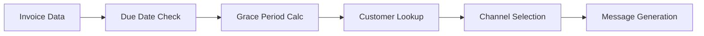

# 💰 Smart Payment Follow-Up Agent

**Day 1 Agent** | **Category**: Finance & Accounting | **Complexity**: ⭐⭐⭐

## Overview

The Smart Payment Follow-Up Agent automates invoice payment reminders using a multi-channel escalation strategy. It reduces Days Sales Outstanding (DSO) by 25-40% through intelligent, personalized follow-up sequences.

## Real-World Problem

**Challenge**: Manual invoice follow-ups are time-consuming, inconsistent, and often ineffective. Finance teams spend 15-20 hours per week chasing payments, leading to:
- Increased DSO (Days Sales Outstanding)
- Cash flow problems
- Strained customer relationships
- High administrative costs

**Solution**: Automated, intelligent payment follow-ups that:
- Respect customer preferences and time zones
- Escalate appropriately based on amount and history
- Maintain professional, personalized communication
- Track and optimize follow-up effectiveness

## How It Works

### 1. Data Processing


### 2. Escalation Sequence
1. **Day 0**: Invoice sent (baseline)
2. **Day +3**: Grace period ends, first reminder (WhatsApp/SMS)
3. **Day +5**: Second reminder (Email)
4. **Day +8**: Final reminder (Phone call scheduled)
5. **Day +10**: Escalation to finance manager

### 3. Channel Intelligence
- **WhatsApp**: Quick, personal, high open rates
- **Email**: Formal documentation, attachments
- **Phone**: High-value accounts, urgent situations
- **Slack**: Internal team notifications

## Implementation

### Core API Endpoint
```typescript
// app/api/payment-follow-up/route.ts
import { NextRequest, NextResponse } from "next/server";
import { PaymentFollowUpSchema } from "@/lib/schemas";

export async function POST(req: NextRequest) {
  const body = await req.json();
  const { invoices, policy } = PaymentFollowUpSchema.parse(body);
  
  const results = [];
  
  for (const invoice of invoices) {
    const daysPastDue = calculateDaysPastDue(invoice.due_date);
    
    if (daysPastDue > policy.grace_days) {
      const action = determineAction(daysPastDue, policy);
      const result = await executeAction(invoice, action);
      results.push(result);
    }
  }
  
  return NextResponse.json({ results });
}
```

### Schema Definition
```typescript
// lib/schemas.ts
export const PaymentFollowUpSchema = z.object({
  invoices: z.array(z.object({
    id: z.string(),
    number: z.string(),
    contact_id: z.string(),
    amount: z.number(),
    currency: z.string(),
    due_date: z.string(),
    status: z.enum(['open', 'paid', 'overdue'])
  })),
  policy: z.object({
    grace_days: z.number(),
    sequence: z.array(z.object({
      channel: z.enum(['whatsapp', 'email', 'phone', 'slack']),
      template: z.string(),
      wait_hours: z.number().optional()
    }))
  })
});
```

## Configuration

### Policy Configuration
```yaml
# data/agents-seed-pack-full/day01_Smart_Payment_Follow-Up/policy.yaml
grace_days: 3
sequence:
  - channel: whatsapp
    template: "Hi {{name}}, invoice {{number}} ({{amount}} {{currency}}) is due {{due_date}}."
  - wait_hours: 48
  - channel: email
    subject: "Payment reminder: {{number}}"
    body: "Please clear dues or reply if you need help."
  - wait_hours: 72
  - escalate_to: "finance@yourco.com"
suppression:
  hours_between_touches: 20
  local_hours_window: "09:00-18:00"
```

### Environment Variables
```bash
# Communication channels
WHATSAPP_TOKEN=your_whatsapp_token
WHATSAPP_PHONE_ID=your_phone_id
SMTP_HOST=smtp.gmail.com
SMTP_USER=your_email
SMTP_PASS=your_password

# CRM integration
HUBSPOT_API_KEY=your_hubspot_key
SALESFORCE_CLIENT_ID=your_sf_client_id
```

## Sample Data

### Invoices CSV
```csv
id,org_id,number,contact_id,issue_date,due_date,amount,currency,status
inv-1001,org-1,INV-1001,c-49,2025-08-27,2025-09-11,2159.97,USD,paid
inv-1002,org-1,INV-1002,c-2,2025-08-22,2025-09-29,4498.75,USD,open
inv-1003,org-1,INV-1003,c-99,2025-08-24,2025-09-18,2504.43,USD,overdue
```

### Contacts CSV
```csv
id,name,email,phone,whatsapp,preferred_channel,timezone
c-2,John Smith,john@company.com,+1234567890,+1234567890,whatsapp,America/New_York
c-49,Sarah Johnson,sarah@corp.com,+1987654321,,email,Europe/London
c-99,Mike Chen,mike@startup.io,+1555123456,+1555123456,whatsapp,Asia/Singapore
```

## Real-World Enhancements

### 1. AI-Powered Personalization
```typescript
async function generatePersonalizedMessage(invoice: Invoice, contact: Contact) {
  const prompt = `
    Generate a personalized payment reminder for:
    - Customer: ${contact.name}
    - Invoice: ${invoice.number}
    - Amount: ${invoice.amount} ${invoice.currency}
    - Days overdue: ${calculateDaysPastDue(invoice.due_date)}
    - Previous interactions: ${contact.interaction_history}
    
    Tone: Professional but friendly
    Length: 1-2 sentences
  `;
  
  const response = await openai.chat.completions.create({
    model: "gpt-4",
    messages: [{ role: "user", content: prompt }]
  });
  
  return response.choices[0].message.content;
}
```

### 2. Predictive Analytics
```typescript
async function predictPaymentProbability(invoice: Invoice, contact: Contact) {
  const features = {
    amount: invoice.amount,
    daysPastDue: calculateDaysPastDue(invoice.due_date),
    customerTier: contact.tier,
    paymentHistory: contact.payment_history,
    industryType: contact.industry
  };
  
  // ML model prediction
  const probability = await paymentPredictionModel.predict(features);
  
  return {
    probability,
    riskLevel: probability < 0.3 ? 'high' : probability < 0.7 ? 'medium' : 'low',
    recommendedAction: getRecommendedAction(probability)
  };
}
```

### 3. Multi-Currency Support
```typescript
function formatCurrency(amount: number, currency: string, locale: string) {
  return new Intl.NumberFormat(locale, {
    style: 'currency',
    currency: currency
  }).format(amount);
}

function convertCurrency(amount: number, from: string, to: string) {
  // Integration with exchange rate API
  const rate = getExchangeRate(from, to);
  return amount * rate;
}
```

### 4. Compliance & Regulations
```typescript
const complianceRules = {
  'US': {
    maxCallsPerDay: 3,
    allowedHours: '08:00-21:00',
    requiredDisclosures: ['debt_collection_notice']
  },
  'EU': {
    gdprCompliant: true,
    consentRequired: true,
    dataRetentionDays: 365
  }
};

function checkCompliance(contact: Contact, action: Action) {
  const rules = complianceRules[contact.country];
  return validateAction(action, rules);
}
```

## Business Impact

### Metrics to Track
- **DSO Reduction**: Target 25-40% improvement
- **Collection Rate**: Increase from 85% to 95%
- **Time Savings**: 15-20 hours/week for finance team
- **Customer Satisfaction**: Maintain >4.5/5 rating

### ROI Calculation
```
Annual Savings = (Hours Saved × Hourly Rate) + (DSO Improvement × Revenue)
Example: (20 hrs/week × 52 weeks × $50/hr) + (10 days × $100K/day) = $1.052M
```

## Advanced Features

### 1. Dynamic Scheduling
- Respect customer time zones
- Avoid holidays and weekends
- Consider industry-specific patterns

### 2. Sentiment Analysis
- Monitor customer responses
- Adjust tone and frequency
- Escalate negative sentiment

### 3. Integration Ecosystem
- **CRM**: Salesforce, HubSpot, Pipedrive
- **Accounting**: QuickBooks, Xero, NetSuite
- **Communication**: Twilio, SendGrid, Slack
- **Analytics**: Mixpanel, Amplitude

### 4. A/B Testing Framework
```typescript
const experiments = {
  'message_tone': ['formal', 'casual', 'urgent'],
  'timing': ['morning', 'afternoon', 'evening'],
  'channel_order': ['whatsapp_first', 'email_first']
};

async function runExperiment(experimentName: string, invoice: Invoice) {
  const variant = getExperimentVariant(experimentName, invoice.id);
  const result = await executeVariant(variant, invoice);
  await trackExperimentResult(experimentName, variant, result);
  return result;
}
```

## Deployment Checklist

- [ ] Configure communication channels (WhatsApp, Email, SMS)
- [ ] Set up CRM integration
- [ ] Import customer and invoice data
- [ ] Configure escalation policies
- [ ] Test with small batch
- [ ] Monitor compliance requirements
- [ ] Set up analytics dashboard
- [ ] Train finance team on new process

## Common Pitfalls & Solutions

### 1. Over-Communication
**Problem**: Bombarding customers with too many reminders
**Solution**: Implement suppression rules and respect preferences

### 2. Poor Timing
**Problem**: Sending reminders at inappropriate times
**Solution**: Use timezone-aware scheduling and business hours

### 3. Generic Messages
**Problem**: Impersonal, template-heavy communication
**Solution**: AI-powered personalization based on customer data

### 4. Compliance Issues
**Problem**: Violating debt collection or privacy laws
**Solution**: Built-in compliance checks and regular audits

This agent transforms payment collection from a manual, reactive process into an intelligent, proactive system that improves cash flow while maintaining customer relationships.
