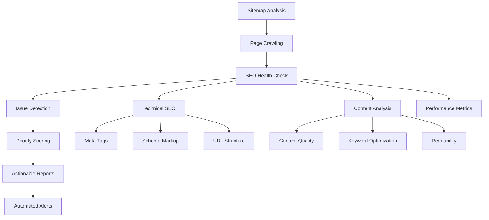

# 🔍 SEO Issue Sentinel

## Overview

The SEO Issue Sentinel is an intelligent monitoring agent that continuously tracks your website's SEO health, identifies issues, and provides actionable recommendations to improve search engine rankings.

## Real-World Problem

**Challenge**: Marketing teams struggle to maintain optimal SEO across hundreds or thousands of web pages. Manual SEO audits are time-consuming, inconsistent, and often miss critical issues that impact search rankings.

**Impact**: Poor SEO leads to:
- Decreased organic traffic (up to 50% loss)
- Lower search engine rankings
- Reduced brand visibility
- Lost revenue opportunities
- Competitive disadvantage

## How It Works



### Core Components

#### 1. Sitemap Discovery & Analysis
```typescript
async function analyzeSitemap(sitemapUrl: string) {
  const sitemap = await fetchSitemap(sitemapUrl);
  
  return {
    totalPages: sitemap.urls.length,
    lastModified: sitemap.lastmod,
    priorities: analyzePriorities(sitemap.urls),
    changeFrequencies: analyzeChangeFreq(sitemap.urls),
    issues: detectSitemapIssues(sitemap)
  };
}
```

#### 2. Page-Level SEO Analysis
```typescript
async function analyzePageSEO(url: string) {
  const page = await crawlPage(url);
  
  const analysis = {
    technical: analyzeTechnicalSEO(page),
    content: analyzeContent(page),
    performance: analyzePerformance(page),
    accessibility: analyzeAccessibility(page)
  };
  
  return {
    url,
    score: calculateSEOScore(analysis),
    issues: identifyIssues(analysis),
    recommendations: generateRecommendations(analysis)
  };
}
```

#### 3. Issue Detection Engine
```typescript
const seoChecks = [
  {
    name: 'Missing Title Tag',
    check: (page) => !page.title || page.title.length === 0,
    severity: 'critical',
    impact: 'High impact on search rankings'
  },
  {
    name: 'Duplicate Meta Description',
    check: (page, allPages) => 
      allPages.filter(p => p.metaDescription === page.metaDescription).length > 1,
    severity: 'high',
    impact: 'Reduces click-through rates'
  },
  {
    name: 'Large Image Files',
    check: (page) => page.images.some(img => img.size > 500000),
    severity: 'medium',
    impact: 'Slows page load speed'
  }
];
```

## Implementation

### API Endpoint
```typescript
// app/api/seo-pages/route.ts
import { NextRequest, NextResponse } from "next/server";
import { analyzeSitemap, analyzePageSEO } from "@/lib/agents/seo-sentinel";

export async function GET(req: NextRequest) {
  try {
    const { searchParams } = new URL(req.url);
    const sitemapUrl = searchParams.get('sitemap_url') || 'https://example.com/sitemap.xml';
    const includeMeta = searchParams.get('include_meta') === 'true';
    
    // Analyze sitemap
    const sitemapAnalysis = await analyzeSitemap(sitemapUrl);
    
    if (includeMeta) {
      // Perform detailed analysis on sample pages
      const samplePages = sitemapAnalysis.urls.slice(0, 10);
      const pageAnalyses = await Promise.all(
        samplePages.map(url => analyzePageSEO(url))
      );
      
      return NextResponse.json({
        sitemap: sitemapAnalysis,
        sampleAnalysis: pageAnalyses,
        recommendations: generateSiteWideRecommendations(pageAnalyses)
      });
    }
    
    return NextResponse.json({
      count: sitemapAnalysis.totalPages,
      urls: sitemapAnalysis.urls,
      last_modified: sitemapAnalysis.lastModified
    });
    
  } catch (error) {
    console.error("SEO Sentinel Error:", error);
    return NextResponse.json(
      { error: "Failed to analyze SEO" },
      { status: 500 }
    );
  }
}
```

### Core Analysis Logic
```typescript
// lib/agents/seo-sentinel.ts
import * as cheerio from 'cheerio';
import { performance } from 'perf_hooks';

export async function analyzePageSEO(url: string) {
  const startTime = performance.now();
  
  try {
    // Fetch page content
    const response = await fetch(url, {
      headers: {
        'User-Agent': 'SEO-Sentinel-Bot/1.0'
      }
    });
    
    const html = await response.text();
    const $ = cheerio.load(html);
    const loadTime = performance.now() - startTime;
    
    // Extract SEO elements
    const analysis = {
      url,
      title: $('title').text(),
      metaDescription: $('meta[name="description"]').attr('content'),
      metaKeywords: $('meta[name="keywords"]').attr('content'),
      headings: extractHeadings($),
      images: extractImages($),
      links: extractLinks($),
      schema: extractSchemaMarkup($),
      performance: {
        loadTime,
        responseStatus: response.status,
        contentLength: html.length
      }
    };
    
    // Analyze and score
    const issues = detectSEOIssues(analysis);
    const score = calculateSEOScore(analysis, issues);
    const recommendations = generateRecommendations(issues);
    
    return {
      ...analysis,
      score,
      issues,
      recommendations
    };
    
  } catch (error) {
    return {
      url,
      error: error.message,
      score: 0,
      issues: [{ type: 'crawl_error', severity: 'critical', message: error.message }]
    };
  }
}

function detectSEOIssues(analysis: PageAnalysis) {
  const issues = [];
  
  // Title tag issues
  if (!analysis.title) {
    issues.push({
      type: 'missing_title',
      severity: 'critical',
      message: 'Page is missing a title tag',
      recommendation: 'Add a descriptive title tag (50-60 characters)'
    });
  } else if (analysis.title.length > 60) {
    issues.push({
      type: 'long_title',
      severity: 'medium',
      message: `Title tag is too long (${analysis.title.length} characters)`,
      recommendation: 'Shorten title to 50-60 characters'
    });
  }
  
  // Meta description issues
  if (!analysis.metaDescription) {
    issues.push({
      type: 'missing_meta_description',
      severity: 'high',
      message: 'Page is missing a meta description',
      recommendation: 'Add a compelling meta description (150-160 characters)'
    });
  } else if (analysis.metaDescription.length > 160) {
    issues.push({
      type: 'long_meta_description',
      severity: 'medium',
      message: `Meta description is too long (${analysis.metaDescription.length} characters)`,
      recommendation: 'Shorten meta description to 150-160 characters'
    });
  }
  
  // Heading structure issues
  const h1Count = analysis.headings.filter(h => h.level === 1).length;
  if (h1Count === 0) {
    issues.push({
      type: 'missing_h1',
      severity: 'high',
      message: 'Page is missing an H1 tag',
      recommendation: 'Add a single, descriptive H1 tag'
    });
  } else if (h1Count > 1) {
    issues.push({
      type: 'multiple_h1',
      severity: 'medium',
      message: `Page has ${h1Count} H1 tags`,
      recommendation: 'Use only one H1 tag per page'
    });
  }
  
  // Image optimization issues
  const imagesWithoutAlt = analysis.images.filter(img => !img.alt).length;
  if (imagesWithoutAlt > 0) {
    issues.push({
      type: 'missing_alt_text',
      severity: 'medium',
      message: `${imagesWithoutAlt} images missing alt text`,
      recommendation: 'Add descriptive alt text to all images'
    });
  }
  
  // Performance issues
  if (analysis.performance.loadTime > 3000) {
    issues.push({
      type: 'slow_load_time',
      severity: 'high',
      message: `Page loads slowly (${Math.round(analysis.performance.loadTime)}ms)`,
      recommendation: 'Optimize images, minify CSS/JS, use CDN'
    });
  }
  
  return issues;
}

function calculateSEOScore(analysis: PageAnalysis, issues: SEOIssue[]) {
  let score = 100;
  
  issues.forEach(issue => {
    switch (issue.severity) {
      case 'critical':
        score -= 25;
        break;
      case 'high':
        score -= 15;
        break;
      case 'medium':
        score -= 10;
        break;
      case 'low':
        score -= 5;
        break;
    }
  });
  
  return Math.max(0, score);
}
```

## Configuration

### Environment Variables
```bash
# Optional: Custom crawling settings
SEO_CRAWL_DELAY=1000          # Delay between requests (ms)
SEO_MAX_PAGES=100             # Maximum pages to analyze
SEO_USER_AGENT=SEO-Sentinel   # Custom user agent
SEO_TIMEOUT=30000             # Request timeout (ms)

# Optional: External SEO APIs
GOOGLE_PAGESPEED_API_KEY=your_key
SCREAMING_FROG_API_KEY=your_key
```

### Sample Data
The agent includes sample sitemap data for testing:

<augment_code_snippet path="data/agents-seed-pack-full/day15_SEO_Issue_Sentinel/sitemap.xml" mode="EXCERPT">
````xml
<?xml version="1.0" encoding="UTF-8"?>
<urlset xmlns="http://www.sitemaps.org/schemas/sitemap/0.9">
  <url>
    <loc>https://example.com/</loc>
    <lastmod>2025-10-14</lastmod>
    <priority>1.0</priority>
  </url>
  <url>
    <loc>https://example.com/about</loc>
    <lastmod>2025-10-10</lastmod>
    <priority>0.8</priority>
  </url>
</urlset>
````
</augment_code_snippet>

## Real-World Enhancements

### 1. Advanced SEO Monitoring
```typescript
// Continuous monitoring with alerts
const seoMonitor = {
  scheduleChecks: async (urls: string[], frequency: string) => {
    // Schedule regular SEO audits
    const cron = new CronJob(frequency, async () => {
      const results = await Promise.all(urls.map(analyzePageSEO));
      const criticalIssues = results.filter(r => 
        r.issues.some(i => i.severity === 'critical')
      );
      
      if (criticalIssues.length > 0) {
        await sendSEOAlert(criticalIssues);
      }
    });
    
    cron.start();
  },
  
  trackRankings: async (keywords: string[]) => {
    // Monitor search engine rankings
    const rankings = await Promise.all(
      keywords.map(keyword => checkRanking(keyword))
    );
    
    return rankings;
  }
};
```

### 2. Competitive Analysis
```typescript
// Compare SEO performance with competitors
const competitorAnalysis = {
  compareWithCompetitors: async (yourSite: string, competitors: string[]) => {
    const analyses = await Promise.all([
      analyzePageSEO(yourSite),
      ...competitors.map(analyzePageSEO)
    ]);
    
    return {
      yourSite: analyses[0],
      competitors: analyses.slice(1),
      recommendations: generateCompetitiveRecommendations(analyses)
    };
  }
};
```

### 3. Content Optimization
```typescript
// AI-powered content recommendations
const contentOptimizer = {
  optimizeContent: async (content: string, targetKeywords: string[]) => {
    const analysis = await analyzeContentSEO(content, targetKeywords);
    
    return {
      keywordDensity: analysis.keywordDensity,
      readabilityScore: analysis.readability,
      suggestions: [
        'Add more semantic keywords',
        'Improve content structure with subheadings',
        'Increase content length to 1500+ words'
      ]
    };
  }
};
```

### 4. Technical SEO Automation
```typescript
// Automated technical SEO fixes
const technicalSEO = {
  generateRobotsTxt: (sitemapUrl: string) => {
    return `User-agent: *
Allow: /
Sitemap: ${sitemapUrl}`;
  },
  
  generateSchemaMarkup: (pageType: string, data: any) => {
    // Generate JSON-LD schema markup
    const schema = {
      "@context": "https://schema.org",
      "@type": pageType,
      ...data
    };
    
    return JSON.stringify(schema, null, 2);
  }
};
```

## Business Impact

### Metrics to Track
- **Organic Traffic Growth**: 20-40% increase within 3 months
- **Search Rankings**: Improved positions for target keywords
- **Page Load Speed**: Reduced bounce rates by 15-25%
- **Click-Through Rates**: Improved CTR from search results
- **Technical Issues**: 90% reduction in SEO errors

### ROI Calculation
```typescript
const seoROI = {
  calculateValue: (metrics: SEOMetrics) => {
    const organicTrafficValue = metrics.organicTraffic * metrics.avgOrderValue * metrics.conversionRate;
    const timesSaved = metrics.automatedChecks * 0.5; // 30 min per manual check
    const costSavings = timesSaved * metrics.hourlyRate;
    
    return {
      monthlyValue: organicTrafficValue,
      timeSavings: timesSaved,
      costSavings: costSavings,
      totalROI: (organicTrafficValue + costSavings) / metrics.toolCost
    };
  }
};
```

## Advanced Features

### 1. Multi-Language SEO
- Hreflang tag validation
- International targeting analysis
- Localized keyword optimization

### 2. Mobile SEO
- Mobile-first indexing compliance
- Core Web Vitals monitoring
- AMP validation

### 3. E-commerce SEO
- Product schema markup
- Category page optimization
- Faceted navigation analysis

### 4. Local SEO
- Google My Business optimization
- Local citation analysis
- NAP (Name, Address, Phone) consistency

## Integration Examples

### Slack Notifications
```typescript
// Send SEO alerts to Slack
const slackIntegration = {
  sendAlert: async (issues: SEOIssue[]) => {
    const message = {
      text: "🚨 Critical SEO Issues Detected",
      attachments: issues.map(issue => ({
        color: issue.severity === 'critical' ? 'danger' : 'warning',
        fields: [
          { title: "Page", value: issue.url, short: true },
          { title: "Issue", value: issue.message, short: true },
          { title: "Recommendation", value: issue.recommendation, short: false }
        ]
      }))
    };
    
    await fetch(process.env.SLACK_WEBHOOK_URL, {
      method: 'POST',
      body: JSON.stringify(message)
    });
  }
};
```

### Google Analytics Integration
```typescript
// Track SEO improvements in GA
const analyticsIntegration = {
  trackSEOEvent: async (eventData: SEOEvent) => {
    await gtag('event', 'seo_improvement', {
      event_category: 'SEO',
      event_label: eventData.type,
      value: eventData.scoreImprovement
    });
  }
};
```

The SEO Issue Sentinel transforms manual SEO auditing into an automated, intelligent monitoring system that continuously optimizes your website's search engine performance.
