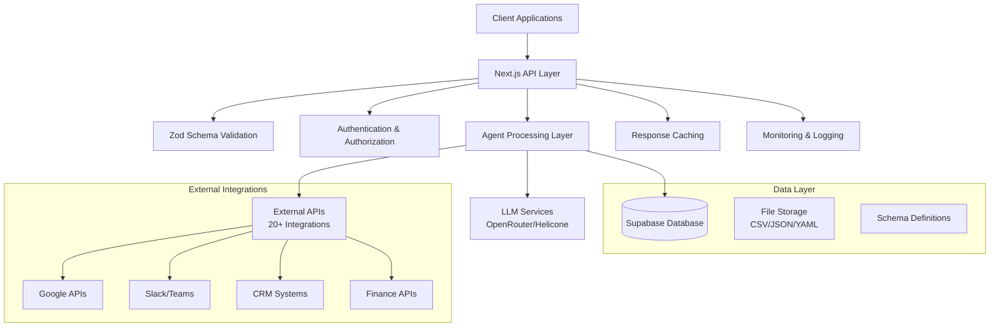

# 🏗️ Architecture Overview

## System Architecture

The 30 Agents Starter Repository follows a modern, scalable architecture designed for production-ready business automation agents.



## Core Components

### 1. API Layer (`app/api/`)
- **Next.js 14 App Router**: Modern React framework with server-side rendering
- **TypeScript**: Full type safety across the application
- **RESTful Endpoints**: Standardized API design patterns
- **Error Handling**: Comprehensive error management and logging

### 2. Agent Processing Layer
- **Modular Design**: Each agent is self-contained with its own logic
- **Schema Validation**: Zod-powered input/output validation
- **Data Processing**: Efficient handling of CSV, JSON, and other formats
- **AI Integration**: Seamless LLM integration for intelligent processing

### 3. Data Management
- **Supabase**: PostgreSQL database with real-time capabilities
- **File Storage**: Organized seed data and configuration files
- **Schema Definitions**: Centralized data models and validation rules
- **Migration Support**: Database versioning and updates

### 4. External Integrations
- **OAuth Flows**: Secure authentication with external services
- **Webhook Handling**: Real-time event processing
- **Rate Limiting**: Intelligent API usage management
- **Error Recovery**: Robust retry mechanisms and fallbacks

## Design Principles

### 1. Modularity
Each agent is designed as an independent module that can be:
- Developed separately
- Tested in isolation
- Deployed independently
- Scaled based on demand

### 2. Type Safety
- Full TypeScript coverage
- Zod schema validation
- Compile-time error detection
- Runtime type checking

### 3. Scalability
- Stateless design for horizontal scaling
- Database connection pooling
- Efficient caching strategies
- Load balancing ready

### 4. Maintainability
- Clear separation of concerns
- Comprehensive documentation
- Standardized code patterns
- Automated testing

## Data Flow

### 1. Request Processing
```
Client Request → API Route → Validation → Agent Logic → Response
```

### 2. Agent Execution
```
Input Data → Schema Validation → Business Logic → External APIs → Output Generation
```

### 3. Error Handling
```
Error Occurrence → Logging → User-Friendly Response → Monitoring Alert
```

## Security Architecture

### 1. Authentication & Authorization
- API key management
- Role-based access control
- Session management
- Token validation

### 2. Data Protection
- Input sanitization
- SQL injection prevention
- XSS protection
- CSRF tokens

### 3. External API Security
- Secure credential storage
- OAuth token management
- Rate limiting
- Request signing

## Performance Optimization

### 1. Caching Strategy
- Response caching for static data
- Database query optimization
- CDN integration
- Browser caching headers

### 2. Database Optimization
- Efficient indexing
- Connection pooling
- Query optimization
- Read replicas for scaling

### 3. API Optimization
- Payload compression
- Streaming responses
- Batch processing
- Async operations

## Monitoring & Observability

### 1. Application Monitoring
- Performance metrics
- Error tracking
- User analytics
- Resource utilization

### 2. LLM Monitoring (Helicone)
- Token usage tracking
- Response time monitoring
- Cost optimization
- Quality metrics

### 3. Infrastructure Monitoring
- Server health checks
- Database performance
- API response times
- External service status

## Deployment Architecture

### 1. Development Environment
- Local development server
- Hot reload capabilities
- Test data seeding
- Debug tooling

### 2. Staging Environment
- Production-like setup
- Integration testing
- Performance testing
- Security scanning

### 3. Production Environment
- Auto-scaling capabilities
- Load balancing
- Backup strategies
- Disaster recovery

## Technology Stack Details

### Frontend/API
- **Next.js 14**: React framework with App Router
- **TypeScript**: Static type checking
- **Zod**: Runtime type validation
- **Tailwind CSS**: Utility-first styling (if UI needed)

### Backend Services
- **Supabase**: Database and authentication
- **OpenRouter**: Multi-model LLM access
- **Helicone**: LLM observability
- **Vercel**: Hosting and deployment

### Development Tools
- **Vitest**: Testing framework
- **ESLint**: Code linting
- **Prettier**: Code formatting
- **GitHub Actions**: CI/CD pipeline

### External Integrations
- **Google APIs**: Calendar, Drive, Docs
- **Slack/Teams**: Communication
- **CRM Systems**: Salesforce, HubSpot
- **Finance APIs**: Stripe, QuickBooks
- **Email Services**: SendGrid, Mailgun

## Scalability Considerations

### 1. Horizontal Scaling
- Stateless application design
- Database connection pooling
- Load balancer configuration
- CDN integration

### 2. Vertical Scaling
- Resource optimization
- Memory management
- CPU utilization
- Storage optimization

### 3. Database Scaling
- Read replicas
- Sharding strategies
- Connection pooling
- Query optimization

## Future Architecture Enhancements

### 1. Microservices Migration
- Service decomposition
- API gateway implementation
- Service mesh integration
- Container orchestration

### 2. Event-Driven Architecture
- Message queues
- Event sourcing
- CQRS patterns
- Real-time processing

### 3. AI/ML Pipeline
- Model training infrastructure
- Feature stores
- A/B testing framework
- Model versioning

This architecture provides a solid foundation for building production-ready business automation agents while maintaining flexibility for future enhancements and scaling requirements.
